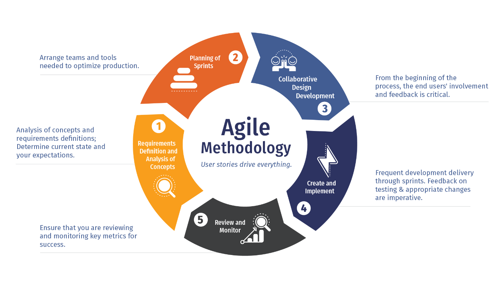
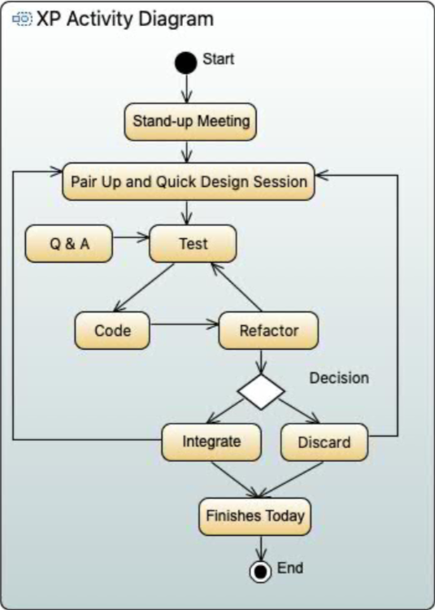

## Agile Software Development~敏捷软件开发~

### Software Process Evolution ~开发过程演变~

- General Process Models

  -> The Waterfall Model==瀑布流开发==(Predictive Processes==预测过程==)

  -> Incremental Development ==增量开发== 

  -> Integration and Configuration==集成和配置==(Reuse-Oriented==重用导向==)

### Principles of Agile Methods ~敏捷开发法则~

- Customer Collaboration 客户合作

  Users should work closely with the development team.
  Users should provide feedback on the system and suggestions for requirements/improvement.
  用户应与开发团队密切合作。
  用户应提供有关系统的反馈和要求/改进的建议。

- Embrace Change 迎接改变

  Changes to the requirements can happen **at any time** during the development.
  Plans can quickly become **inaccurate** with the rapid change to the requirements.在开发期间的任何时间都可以发生对要求的变化。
  计划可以快速变得不准确，以便对要求的快速变化。

- Incremental Delivery 增量交付

  It is more important to deliver the software than following the plan. 
  The software should be developed **incrementally** and **iteratively** with each delivery having more functionalities included.
  提供软件比在计划之后更重要。
  该软件应逐步和迭代地开发，每次发布包括包括更多功能。
  
- Maintain Simplicity 保持简单性

  Keep everything simple, for both the software and the software process.
  Focus on delivering valuable software to the customer rather than writing comprehensive documentation.
  对于软件和软件过程，请一切从简。
  专注于向客户提供有价值的软件，而不是写全面的文档。

- People, not Process 人而不是过程

  Focus on the people on the team. Tools and practices are second.
  People should be left to develop their own ways of working, rather giving prescriptive processes.
  Exploit and explore skills and knowledges of team members and trust them.
  专注于团队的人们。 工具和实践是次要的。
  应该放手人们开发自己的工作方式，而不是提供规定的过程。
  利用并探索团队成员的技能和知识，相信他们。

#### eXtreme Programming

XP是一种软件开发的风格，专注于卓越的编程技术应用，清晰的沟通和团队合作。

- Values

  A philosophy of software development based on the values of communication==交流==, feedback==反馈==, simplicity==简单==, courage==鼓励==, and respect==尊重==.

- Practices

  A body of practices proven useful in improving software development.

- Principles

  A set of complementary principles, intellectual techniques for translating the values into
  practice. **(Value -> Practice)** 
  
  1. Humanity 人性化
     - Balance the needs of the **individual** with the needs of the **team**
  2. Economics 经济效益
     - The **time** value of money 
     - The **option** value of systems and teams
  3. Mutual Benefit 互惠互利
    - Every activity should benefit all concerned 
    - Write automated tests that help the design and implementation better today; leave the test as the ‘documentation’ for future programmers
    - Refactor to improve simplicity, clarity and coherence
  
  4. Self-Similarity 自似性
     - Use the structure of one solution into a new context==将一个解决方案的结构使用到新的场景中==, even at different scales (it’s a good place to start)
  5. Improvement 不断改进
    - Get an activity started right away, then refine the results over time.
  6. Diversity 多样性
     - Programmers should work together on the problem and all opinions should be valued
  7. Reflection 复盘
     - Review and analyze why they succussed or failed
  
  8. Flow 流程
     - Continuous flow of activities rather than discrete phase (small increments, continuous integration) 连续的活动流，而不是离散相位（小增量，持续集成）
  9. Opportunity 机会
     - Seeing problems as opportunities for changes (personal growth, deepening relationships, and improved software)
  10. Redundancy 冗余
      - Difficult problems in software development should be solved in several different ways.
  11. Failure ？
      - If you have 3 ways to implement a user story, but you don’t know which to
        use, try all of them
  
  12. Quality 质量
      - Quality can be measured in **defect**, **design quality**, and **the experience of development**. 衡量缺陷，设计质量和发展的经验
  13. Baby Step ？
      - Proceeds one test at a time, and integrates and test a few hours’ worth of changes at a time
  14. Accepted Responsibility 接受责任分配
      - Responsibility cannot be assigned; it can only be accepted

### XP Workflow ~XP工作流~

#### Terminology: User Story

- Agile methods do not usually have a separate requirements engineering activity, rather integrate it with development. 敏捷开发通常不具有一个分离出来的需求工程活动，而是集成 `User Story` 到开发中。
- User stories are often written on <u>user story index cards</u>==用户事物索引卡==.
  - It addresses user needs 定位用户需求
  - It can be used in planning system iterations. 用于规划系统迭代
  - The use and/or the product manager prioritize the stories for implementation. 在使用或者产品管理中优先考虑执行情况
    - High business value 高商业价值
    - Significant impact on architectural design 对结构设计的显著影响
  - Structured Template 
    - As a \<role\> (who wants to accomplish something) 
    - I want to \<activity\> (what) 
    - So that \<value\> (why) 
    - It may also include Acceptance Criteria and Comments

### XP – Planning the Release ~XP-规划与发布~

