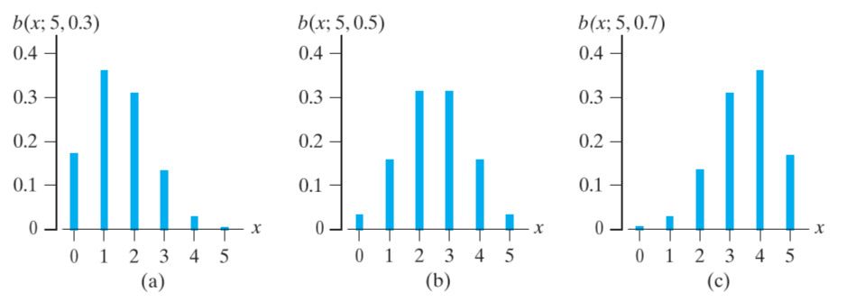

# Chapter 4

[TOC]

## 4.1 Random variables==随机变量==

A **random variable**==随机变量== is any function that assigns a numerical value to each possible outcome. 随机变量是为每个可能的结果分配数值的任何函数。

The **probability distribution**==概率分布== of a discrete random variable X is a list of the possible values of X together with their probabilities. 离散随机变量 X 的概率分布是 X 的可能值及其概率的列表
$$
f(x) = P[X=x]
$$
The **probability distribution**==概率分布== always satisfies the conditions.

$$
f(x) \geq 0\ and\ \sum_{all\ x}f(x)=1
$$

> Example 4.1 Check whether the following can serve as probability distributions:
>
> 1. $$
>    f(x)=\frac{x-2}{2}\ for\ x=1,2,3,4;
>    $$
>
> 2. $$
>    h(x)=\frac{x^2}{25}\ for\ x=0,1,2,3,4.
>    $$

We define $F(x)=P[X\leq x]\ for\ x\in(-\infty,+\infty)$ to be the **cumulative distribution function**==累积分布函数== or just the **distribution function**==分布函数== of the random variable.

## 4.2 The Binomial Distribution==二项分布==

Bernoulli trials==伯努利试验== are trials==试验== that satisfies, 

1. There are only two possible outcomes for each trial.
2. The probability of success is the same for each trial.
2. The outcomes from different trials are independent.
2. There are a fixed number==固定数量== $n$ of Bernoulli trials conducted.

> Example 4.2 Can the following be treated as Bernoulli trials? 
> Drivers stopped at a roadblock will be checked for failure to wear a seatbelt. 停在路障前的司机将被检查是否未系安全带。

二项分布是形容伯努利试验的特征，即非正即负的这种状态，而伯努利试验是这类试验的名字。

> Example 4.3 <u>Binomial probability distribution</u>==二项分布== n=3
>
> 略，即在单位时间内发生一定次数，概率不变，结果只有两个，true or false，总概率为由累乘获得的各事件概率之和。

$$
b(x;n,p)=\bigg( \begin{matrix} n \\ x \end{matrix} \bigg)   p^x(1-p)^{n-x}, x=0,1,2,\dots,n
$$

$n$ is the total number, 
$p$ is the successful probability of each time, 
$x$ is the times trial success.  

$\bigg( \begin{matrix} n \\ x \end{matrix} \bigg)$ is the <u>binomial coefficients</u>==二项式系数==

Actually, the preceding equation defines <u>a family of probability distributions</u>==概率分布族==, with each <u>member characterized</u>==成员特征== by a given value of the parameter p and the number of trials n.

For example, when $p$ equals to 0.5, the equation will become the <u>symmetrical distribution</u>==对称分布==， $b(x;n,0.5)=\bigg( \begin{matrix} n \\ x \end{matrix} \bigg)   0.5^{n}$ 

Finally, a probability distribution that has a probability bar chart like those in Figure 4.4(a) and 4.4(c) is said to be a <u>long-tailed or skewed distribution</u>==长尾分布或偏斜分布==. It is said to be a <u>positively skewed distribution</u>==正偏态分布== if the tail is on the right, and it is said to be <u>negatively skewed</u>==负偏态== if the tail is on the left.

> Example 4.4 
> It has been claimed that in 60% of all solar-heat installations the utility bill is reduced by at least one-third. Accordingly, what are the probabilities that the utility bill will be reduced by at least one-third in
> (a) four of five installations;
> (b) at least four of five installations?
>
> Solution: 
>
> 1. Substituting x = 4, n = 5, and p = 0.60 into the formula for the binomial distribution, we get, 
>    $$
>    b(4; 5, 0.60) &=& \bigg( \begin{matrix} 5 \\ 4 \end{matrix} \bigg)(0.60)^4(1-0.60)^{5-4}\\
>    &=& 0.259
>    $$
>
> 2. Substituting x = 5, n = 5, and p = 0.60 into the formula for the binomial distribution, we get, 
>    $$
>    b(5; 5, 0.60) &=& \bigg( \begin{matrix} 5 \\ 5 \end{matrix} \bigg)(0.60)^5(1-0.60)^{5-5}\\
>    &=& 0.078
>    $$
>    and the answer is $b(4;5,0.6)+b(5;5,0.6)=0.259+0.078=0.337$. 

If n is large, the calculation of binomial probabilities can become quite tedious==繁琐==. 

Book support the table to check that. 给的是累计概率。

However, that the values of $b(x;n,p)$ can be obtained by subtracting adjacent entries in
Table 1. Because the two cumulative probabilities $B( x; n, p)$ and $B( x−1; n, p)$ differ by the single term $b( x; n, p)$. 

> Example 4.5 Evaluating <u>cumulative</u>==累积的== binomial probabilities
> If the probability is 0.05 that a certain wide-flange column will fail under a given axial load, what are the probabilities that among 16 such columns
> (a) at most two will fail;
> (b) at least four will fail?
>
> 1. From the table, know that $B(2;16,0.05) = 0.9571$
>
> 2. Since
>    $$
>    \sum_{x=4}^{16} b(x;16,0.05) = 1- B(3;16,0.05)
>    $$
>    Table 1 yields $1-0.9930 = 0.0070$. 

## 4.3 The Hypergeometric Distribution==超几何分布==

## 4.10 Simulation
