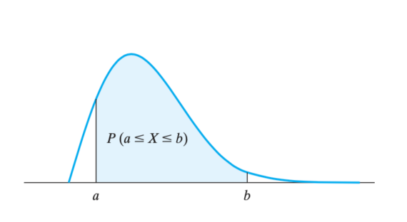

# Chapter 5

[TOC]

Content: Probability Densities 概率密度

## 5.1 Continuous random variables~连续随机变量~

Suppose we are interested in **the probability that a given continuous random variable will take on a value on the interval==区间== from a to b**==给定的连续随机变量在 a 到 b 区间中的概率==, where a and b are <u>constants</u>==常量== with a ≤ b. 

Suppose, furthermore, that we divide the interval from a to b into m <u>equal subintervals</u>==等长子区间== of width $\Delta x$ containing, respectively==分别==, the points $x_1, x_2, \dots, x_m$, 
And that the probability that the random variable will take on a value in the subinterval containing $x_i$ is given by $f(x_i)\Delta x_i$. Then the probability that the random variable with which we are concerned will take on a value in the interval from a to b is given by, 
$$
P(a \leq X \leq b) = \sum_{i=1}^{m}f(x_i)\Delta x_i
$$
When f is an <u>integrable function</u>==可积函数== defined for all values of the random variable with which we are concerned, we shall define the probability that the value of the random variable falls between a and b by letting $\Delta x \rightarrow 0$. Namely==即==,
$$
P(a \leq X \leq b) = \int_{a}^{b}f(x)dx
$$

The function f are called <u>probability density function or probability density</u> ==概率密度函数或概率密度== 

It is clear that
$$
P(a \leq X \leq b) = P(a \leq X < b) = P(a < X \leq b) = P(a < X < b)
$$
The probability density satisfies:

1. $$
   f(x) \geq 0\ for\ all\ x;
   $$

2. $$
   \int^{\infty}_{-\infty}f(x)dx = 1
   $$

> Definition 5.1 
> We define the cumulative distribution function (or distribution function) F(x) be the probability that a random variable with the probability density f(x) takes on a value less than or equal to x, that is we let F(x) = P(X≤ x) which is the area under the probability density function over the interval −∞ to x.
> In the usual calculus notation for the integral.

So it's clear that,

1. $$
   F(x) = P(X \leq x) = \int^{x}_{-\infty}f(t)dt
   $$

2. $$
   P(a \leq x \leq b) = \int^{b}_{a}f(x)dx=F(b)-F(a)
   $$

3. $$
   \frac{dF(x)}{dx}=f(x)
   $$

a